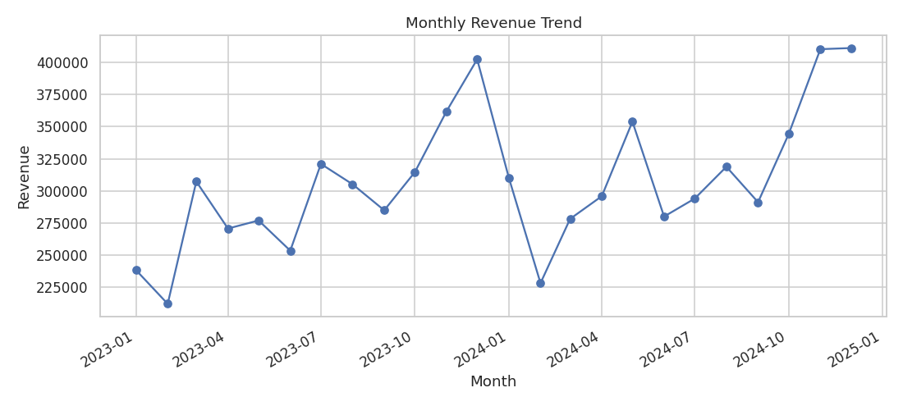
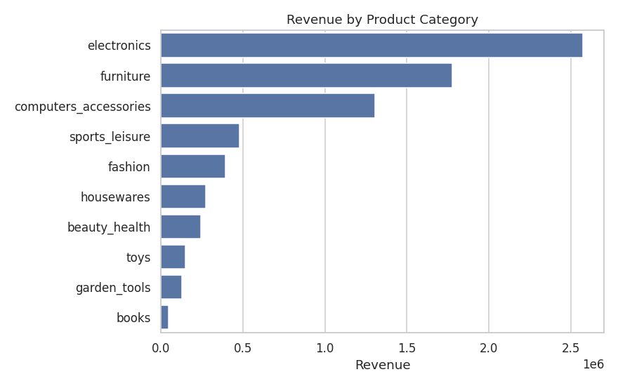
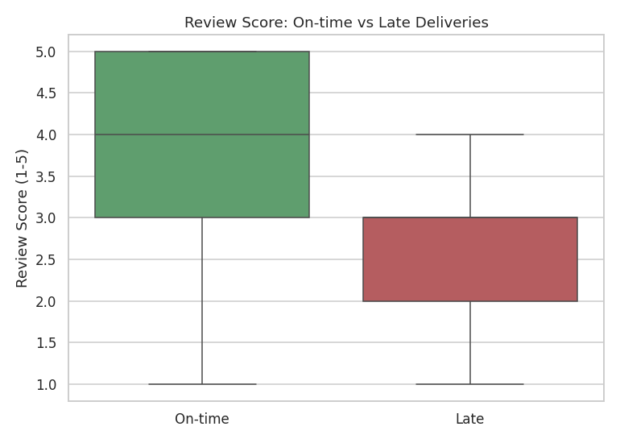
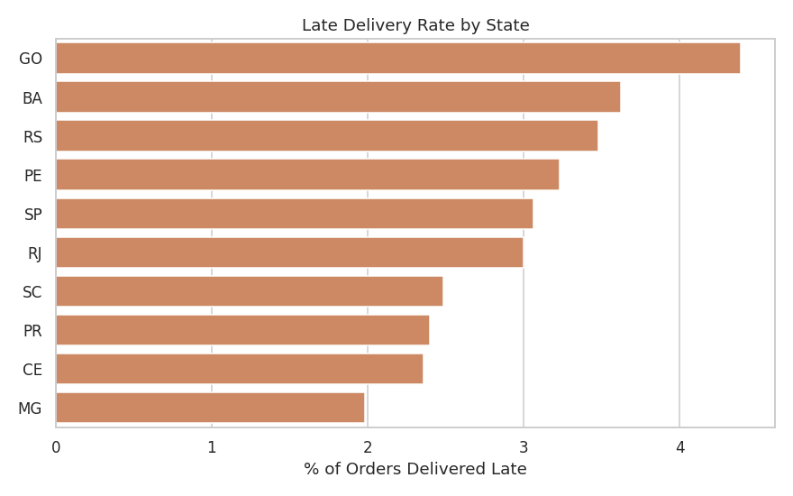
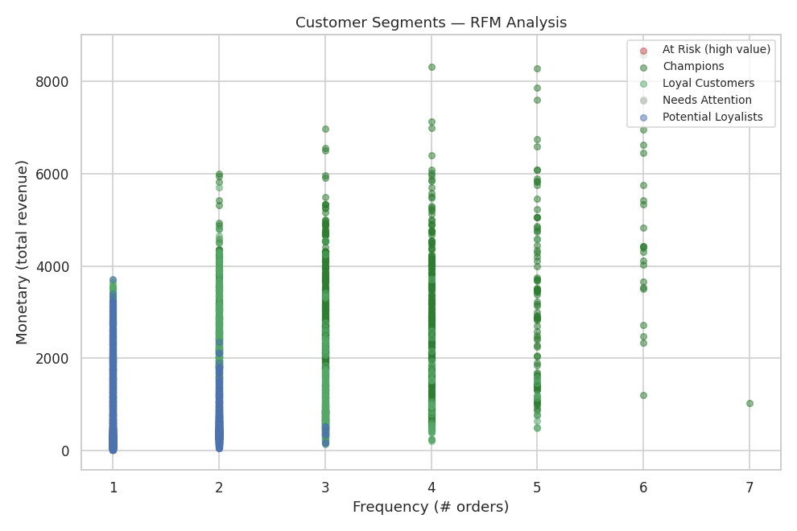

Retail Sales Performance Analysis
An end-to-end exploratory data analysis of e-commerce order data — from raw
data cleaning to a statistically-tested business recommendation.
Skills demonstrated: data cleaning, pandas aggregation, time series
analysis, hypothesis testing, customer segmentation (RFM), and translating
findings into business recommendations.
Business questions answered
What does overall sales performance look like — trend, seasonality, top categories, top regions?
Does late delivery actually hurt customer satisfaction, and is it statistically significant?
Which customers are most valuable, and which are worth a retention push?
Dataset
This project uses a synthetic dataset generated by `src/generate_data.py`,
structured to match the real Olist Brazilian E-Commerce dataset
(orders, pricing, delivery dates, review scores, customer state). This keeps
the project fully reproducible without a manual Kaggle download.
To use the real dataset instead: download the Olist CSVs and adjust the load
step in `src/eda.py` — the column names are kept identical so no other code
needs to change.
Project structure
```
retail-sales-analysis/
├── README.md
├── requirements.txt
├── data/
│   ├── orders.csv              # raw generated data
│   ├── orders_clean.csv        # after cleaning (output of eda.py)
│   └── rfm_segments.csv        # customer segments (output of rfm_segmentation.py)
├── notebooks/
│   ├── 01_eda.ipynb             # exploratory analysis, walkthrough with commentary
│   └── 02_deep_dive.ipynb       # delivery delay vs. review score deep dive
├── src/
│   ├── generate_data.py         # synthetic data generator
│   ├── eda.py                   # cleaning + core EDA plots (script version)
│   ├── deep_dive_delivery.py    # delivery delay analysis (script version)
│   └── rfm_segmentation.py      # customer segmentation
└── images/                      # saved chart PNGs (used below)
```
How to run
```bash
pip install -r requirements.txt
python src/generate_data.py          # creates data/orders.csv
python src/eda.py                    # cleans data, saves charts to images/
python src/deep_dive_delivery.py     # delivery/review analysis
python src/rfm_segmentation.py       # customer segmentation
```
Or open `notebooks/01_eda.ipynb` and `notebooks/02_deep_dive.ipynb` in Jupyter
for the full walkthrough with narrative commentary.
Key findings
1. Revenue trend & seasonality
Revenue shows a clear holiday-season pattern — peaking in November/December and
dipping in February.

2. Top categories & regions
Electronics, furniture, and computer accessories are the top revenue drivers.
Revenue is geographically concentrated, led by São Paulo (SP).

3. Late delivery significantly hurts customer satisfaction
This is the core finding of the deep-dive: average review score drops from
~4.0 to ~2.6 (on a 5-point scale) for late vs. on-time orders — a
difference confirmed with a Welch's t-test (p < 0.001), not just noise.

Recommendation: this is a quantified, defensible case for logistics
investment. Prioritize fixes in the states with the highest late-delivery
rates first, since that's where the satisfaction gain per dollar is largest.

4. Customer segmentation (RFM)
Segmenting customers by Recency, Frequency, and Monetary value identifies
"Champions" (frequent, high-spend, recent buyers — worth retaining) vs.
customers who need re-engagement campaigns.

Segment	Avg. customer value
Champions	Highest
Loyal Customers	High
At Risk (high value)	Moderate — worth a win-back campaign
Potential Loyalists	Moderate
Needs Attention	Low
Tools
Python, pandas, NumPy, matplotlib, seaborn, SciPy (hypothesis testing)
